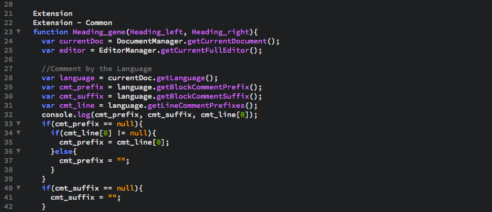
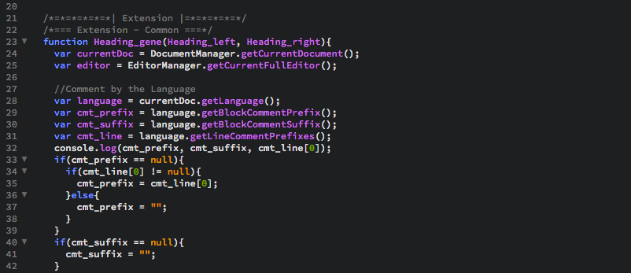
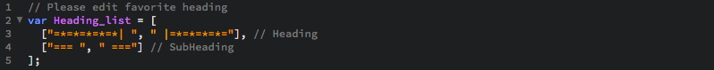

# Add Heading
This extension adds a heading to selected line.

Press the shortcut to convert the string to a heading.

Use any languages in the **Brackets 1.14**.

## How to use
Click the line in the cord you want to add a heading.

Both selected text and unselected text are acceptable.
#### Heading
**Edit > Add Heading**

Windows:  ⇧⌃-
 
Mac:  ⇧⌘-

#### SubHeading
**Edit > Add SubHeading**

Windows:  ⌥⌃-
 
Mac:  ⌥⌘-

## Screenshots
**Before add heading**
 

**After add heading (JavaScript)**
 

## Customize
Change `Heading_list` in **addHeading/main.js**.
 

 
(c) 2020 FK All Rights Reserved.